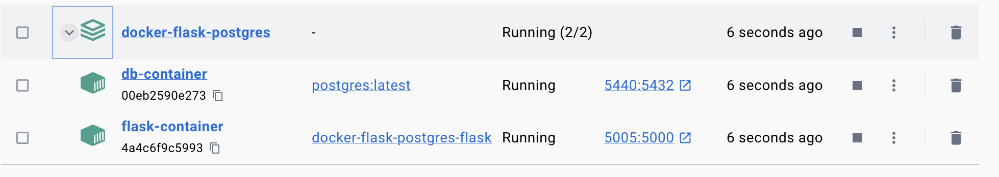
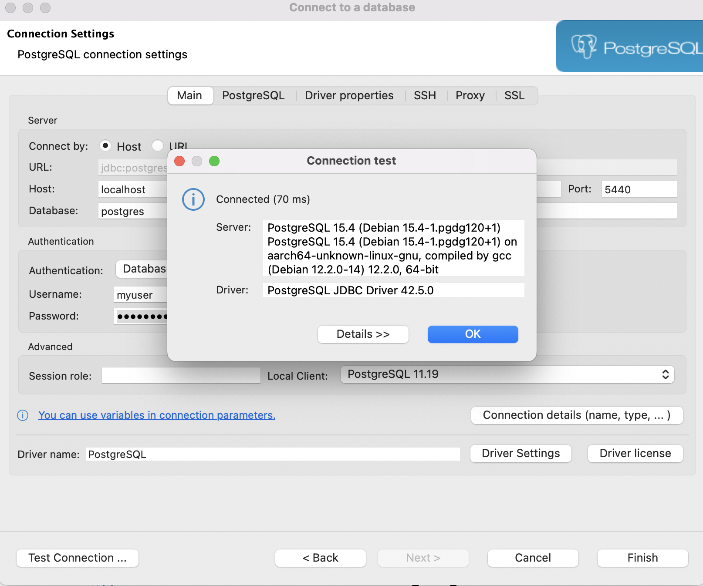
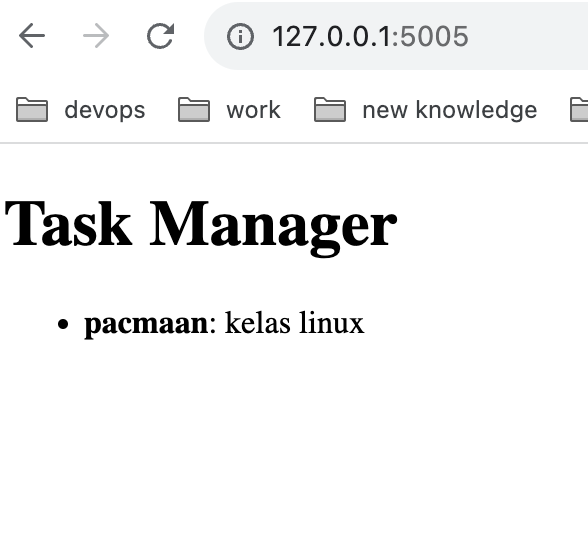

# docker-flask-postgres

docker-flask-postgres build container with docker compose

### A. Background

create containerization on app flask and postgres, then we create script to backup and restore database.

### B. Objective

Program objective:

- Create Docker file on web-app flask
- Create Docker Compose on service web-app and db.
- Create Network between container web-app and db.
- Create volume mounting on database.
- Create backup database script.
- Create restore database script.

Learning objective:

- Docker custome image.
- Docker compose.

### C. Tools

Languages:

- Docker
- Dbeaver


### D. Setup

1. Clone this git repository into your local computer. https://github.com/agnynureza/docker-flask-postgres.git
2. Typing:
    ```
    docker compose up -d
    ```

    

3. Check database connection on dbeaver

    

4. Check web-app running

    

5. Running Backup script:
    ```
    #enable to execute 
    chmod +x {pwd}/backup-db.sh
    ./backup-db.sh
    ```
5. Running Restore script:
    ```
    #try to drop schema 
    #enable to execute 
    chmod +x {pwd}/restore-db.sh
    ./restore-db.sh
    ```